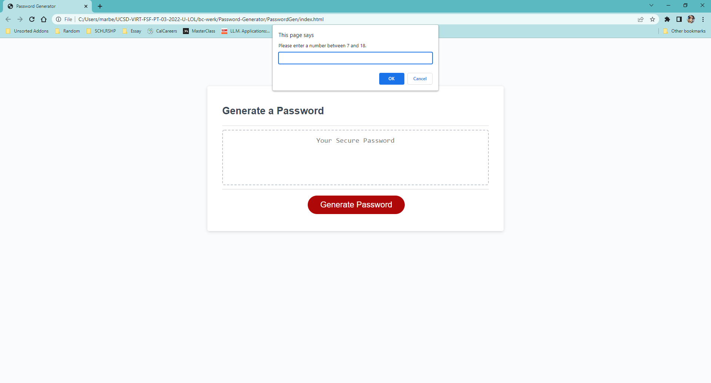
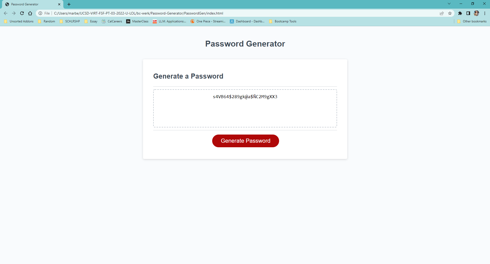

# Password-Generator

This is an attempt at creating a password generator by using different methods of javascript.

This exercise in particular was great because it was simple and straightforward with what it required while allowing me to use "if/else" statements multiple times, which I have found
is great practice for better understanding any function in css and javascript. 
With this I'm hoping future projects that will require similar statements or functions will feel a lot more familiar and show in a clean readable format for code.

I also decided to add more comments as I moved through the code which is a habit I'm trying to be better at and describing more of the reasons as to why im chosing the variables I'm using. For example, I commented how I decided to add the "Ñ" and "ñ" into the mix because they're less common in english therefore making a password far more secure. However, I also added it as a personal touch since it's a common letter in Spanish and a vital letter to my mother's maiden name.

